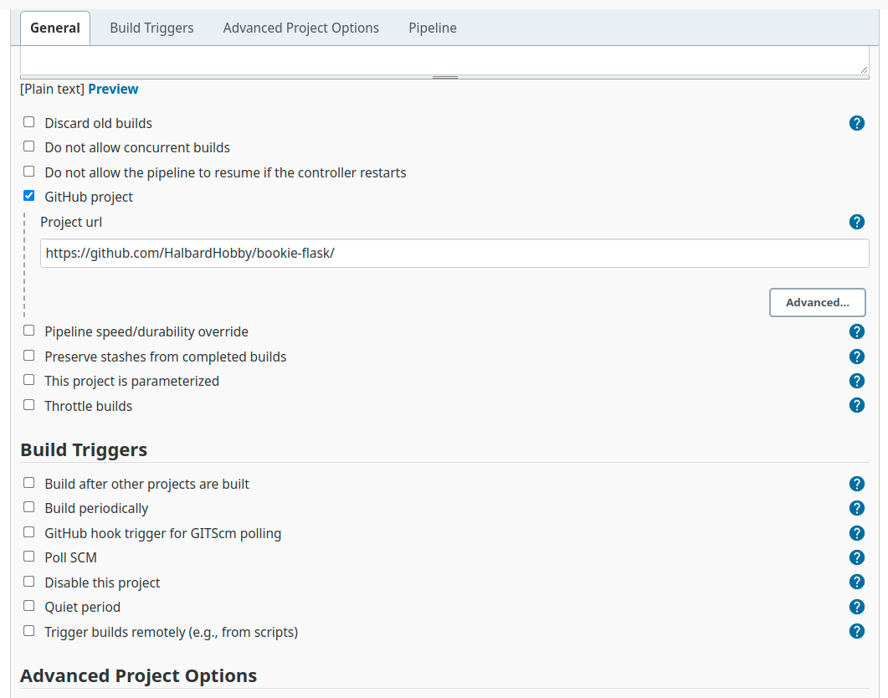
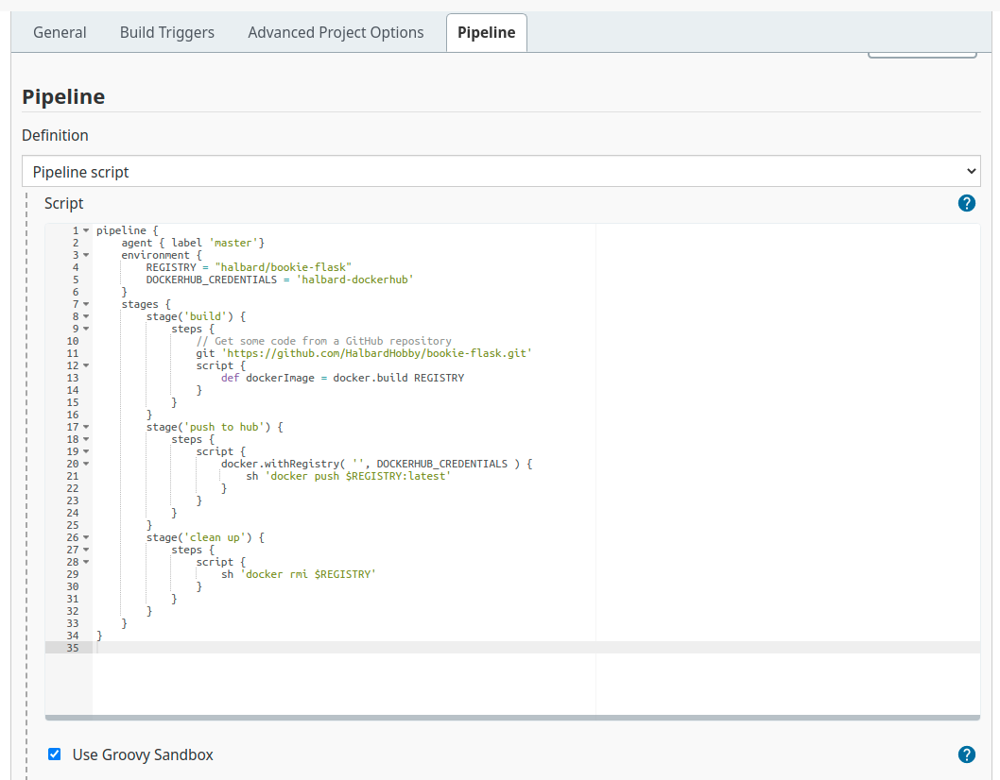
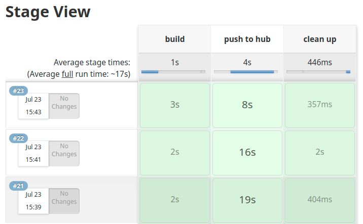

# Jenkins Sample Project

## Dockerizing Jenkins

It is possible to dockerize jenkins to be able to use it in an easier manner. Despite this, there are certain obstacles to overcome in order to use Docker inside a container.

Docker requires both a binary and a socket to communicate with the service. The host machine counts with this socket, hence it is possible to map them as volumes onto the container.

```
-v /var/run/docker.sock:/var/run/docker.sock -v $(which docker):/usr/bin/docker
```

with this volumes, jenkins will be able to use Docker. But there is a catch, The Docker engine requires certain permissions to allow connections to the available socket. Fortunately, the program ``stat`` is able to show what group has this permissions, and with the help of the ``--group-add`` flag, it is possible to assign thee container to this group.

```
--group-add $(stat -c '%g' /var/run/docker.sock)
```
Now with the obstacles overcome, it is possible to use Docker from a container spinning it up with the following command:

```
docker run --rm -d -p 8080:8080 -p 50000:50000 \
           --group-add $(stat -c '%g' /var/run/docker.sock) \
           -v /path/to/jenkins:/var/jenkins_home \
           -v /var/run/docker.sock:/var/run/docker.sock \
           -v $(which docker):/usr/bin/docker jenkins/jenkins
```

---

## Job Configuration

Once Jenkins is up and running, configuring a project is fairly straightforward. Simply configure your pipeline and write your script.




With thsese simple configurations you only need to click "Build Now" and your image will be on route to Docker Hub.



You can checkout [the jenkinsfile](text/jenkinsfile) and the [logs](text/logs.txt). Finally you can check the image built for [the project used](https://github.com/HalbardHobby/bookie-flask) on [DockerHub](https://hub.docker.com/repository/docker/halbard/bookie-flask)

---

## Author

**Alejandro Espinosa**